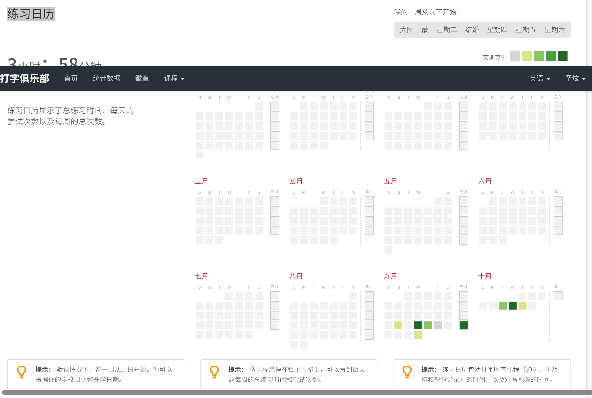
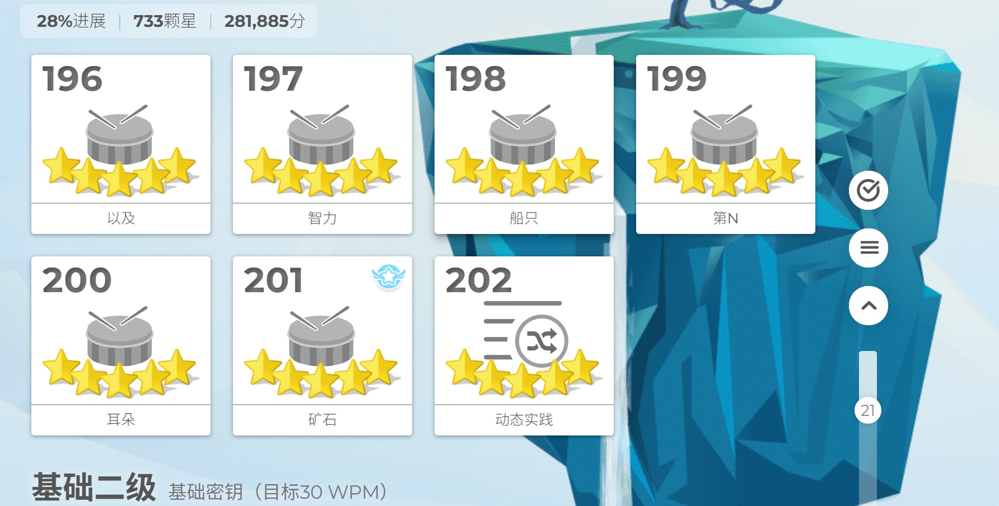

# Lab1：完成 TypingClub 前 202 关

> **作业目标**：完成 TypingClub 第 1—202 关的打字练习，能够在自己的账号中查看练习进度，并用电脑截图记录完成情况。
>
> **提交前请先阅读**：本次作业只允许提交本文末尾列出的 3 个文件：`Lab1.md` 和两张截图。必须完整保留本模板的标题、说明、表格和图片引用，只能在指定位置填写基本信息，不得擅自删除、改写或调整模板内容。

---

## 一、登录 TypingClub 并填写信息

### 1.1 登录账号

1. 打开 [TypingClub](https://www.typingclub.com/)。
2. 登录自己的 TypingClub 账号，进入正在练习的打字课程。
3. 确认页面显示的是自己的账号，后续练习和两张截图必须使用同一账号。

### 1.2 填写基本信息

将下表第二列中的“（填写）”替换为自己的信息，姓名和学号都必须填写，不得删除表格行。

| 项目 | 内容 |
| --- | --- |
| 姓名 |王予炫|
| 学号 | 2026010024 |

---

## 二、完成前 202 关

1. 在课程的关卡选择页面，从第 1 关开始按顺序完成练习，直至第 202 关。
2. 检查第 1—202 关均已完成，不能跳过中间的关卡。
3. 第 202 关的关卡卡片上必须有至少一颗已获得的星星。仅解锁该关、打开练习页面或开始输入，不算完成。
4. 本次不额外设置打字速度、准确率或满星要求，第 202 关有星即可。

---

## 三、练习日程表截图

登录自己的 TypingClub 账号后，按以下路径打开练习日程表：

```text
主页 → 统计数据 → 向下滚动到“练习日程表”
```

1. 在主页顶部点击 **统计数据**。
2. 向下滚动，找到标题为 **练习日程表** 的区域。
3. 截取整个练习日程表区域，保留左侧的练习时间和右侧按月份排列的日历方格。调整浏览器缩放比例，使该区域完整显示并保持文字清晰。

截图中必须清晰显示：

- “练习日程表”标题；
- 累计练习时间及其统计范围；
- 按月份排列的日历方格和练习记录。

截图必须保存为 `imgs/typingclub_calendar.png`。将截图放入指定目录后，下面应能正常显示图片：



---

## 四、第 202 关完成截图

返回 **主页** 的关卡选择页面，向下滚动到 **第 202 关**所在的位置，截取包含第 202 关卡片的关卡页面。

截图必须在同一张图中清晰显示：

1. 第 202 关的完整关卡卡片，编号 **202** 清晰可见。
2. 第 202 关卡片上至少一颗已获得的星星。

保留关卡卡片周围的页面区域，便于确认所在页面。第 202 关有星即可，不要求满星。

截图要求：

- 必须使用电脑自带的截图功能，严禁使用手机拍摄屏幕。
- 两张截图都必须来自本人同一 TypingClub 账号，文字、关卡编号和完成状态必须清晰可读。
- 适当裁剪无关桌面区域，但不能裁掉每张截图要求展示的信息。
- 第 202 关完成截图必须保存为 `imgs/typingclub_202_completed.png`。
- 两张图片均使用 PNG 格式，单个文件均不得超过 5 MB。

将截图放入指定目录后，下面应能正常显示图片：



---

## 五、提交要求

将本文件复制到自己的 `学号姓名/Lab1/Lab1.md`，填写基本信息，并保留两张截图的 Markdown 图片引用。两张图片必须放在自己 `Lab1` 文件夹内的 `imgs` 文件夹中。最终只提交以下 3 个文件：

```text
学号姓名/
└── Lab1/
    ├── Lab1.md
    └── imgs/
        ├── typingclub_calendar.png
        └── typingclub_202_completed.png
```

特别注意：

- 基本信息和两张截图全部必交，不得留空或缺交。
- 必须保留模板全部内容，只替换基本信息表中的填写提示；不得删除任何标题、说明、表格行或图片引用，也不得自行增删小节。
- 两张图片的文件名必须与目录结构完全一致，单词之间使用下划线 `_`，不得使用连字符 `-`。
- 不要提交额外的 Markdown 文件、图片或其他文件。
- `Lab1`、`Lab1.md`、`imgs` 和截图文件名均区分大小写。
- 不得用外部图片链接或 PR 描述中的图片代替本地 `imgs` 文件；提交前预览 `Lab1.md`，确认两张图片均能正常显示。
- PR 标题必须严格使用 `[学号姓名]Lab1作业提交`，右方括号后不能有空格。
- 一个 PR 只能包含本次 Lab1 的 3 个文件，不得修改其他同学、`homework/`、README 或仓库配置。

---

## 六、截止时间

**2026 年 10 月 16 日 24:00（即 2026 年 10 月 17 日 00:00，北京时间）**

以 GitHub 记录的最后一次向 PR 推送代码的时间为准。不晚于上述时刻创建 PR 并完成最后一次推送不算超时；超过该时刻新建 PR，或向已有 PR 推送任何修改，均算作超时。审核未通过的同学请务必在截止前完成修改。
